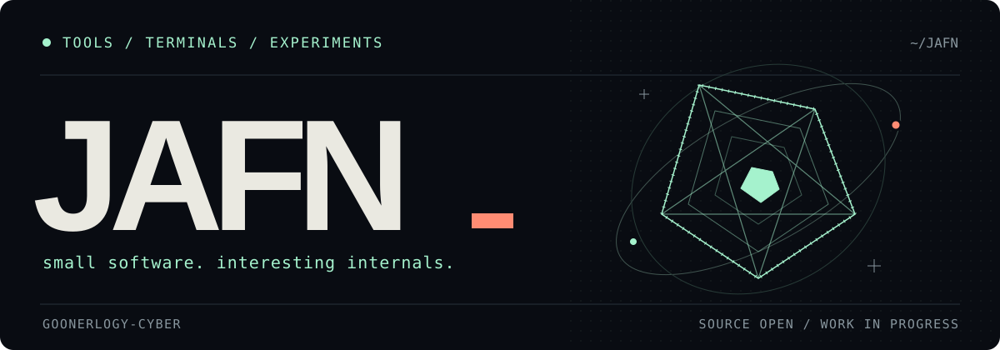
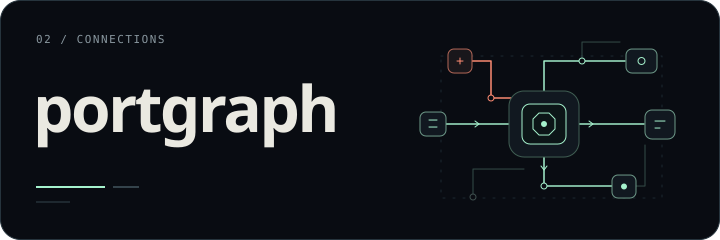
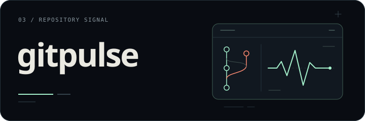
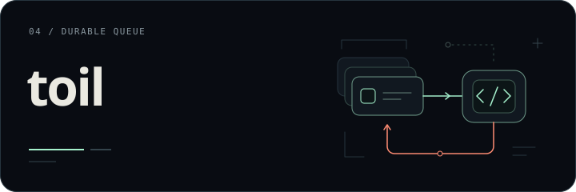
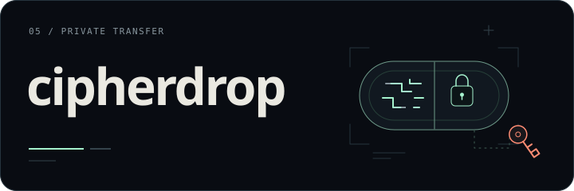

### JAFN

**goonerlogy-cyber**

small tools · clear purpose · useful diffs

I like terminals you can rewind, networks you can inspect, background jobs that finish cleanly, and algorithm visualizers that make the hard parts obvious. Currently working through interesting edge cases in **Go** and **TypeScript**.

[repos](https://github.com/goonerlogy-cyber?tab=repositories) · [pull requests](https://github.com/pulls?q=is%3Apr+is%3Aclosed+author%3Agoonerlogy-cyber)

 

## on the workbench

Six forks I maintain. The linked pull requests document the changes now merged in those forks and how they were tested.

<table>
  <tr>
    <td width="50%" valign="top">
      
      
Rewind a terminal. Keep its screen state intact. <a href="https://github.com/goonerlogy-cyber/replay/pull/1">Alternate-screen support ↗</a>

    </td>
    <td width="50%" valign="top">
      
      
See what is listening, and which process owns it. <a href="https://github.com/goonerlogy-cyber/portgraph/pull/1">IPv6 connection discovery ↗</a>

    </td>
  </tr>
  <tr>
    <td width="50%" valign="top">
      
      
Turn repository activity into scriptable data. <a href="https://github.com/goonerlogy-cyber/gitpulse/pull/1">Versioned JSON reports ↗</a>

    </td>
    <td width="50%" valign="top">
      
      
Make worker shutdown a little less exciting. <a href="https://github.com/goonerlogy-cyber/toil/pull/1">Reliable job completion ↗</a>

    </td>
  </tr>
  <tr>
    <td width="50%" valign="top">
      
      
One-time sharing that stays one-time under load. <a href="https://github.com/goonerlogy-cyber/cipherdrop/pull/1">Atomic burn-after-read ↗</a>

    </td>
    <td width="50%" valign="top">
      
      
Keep secret input exact, including whitespace. <a href="https://github.com/goonerlogy-cyber/zkaudit/pull/1">File and stdin input ↗</a>

    </td>
  </tr>
</table>

These projects began with [arshnah](https://github.com/arshnah). My work is documented in the linked PRs and merged into my forks. Original authorship and licenses stay intact.

under the hood — changes & verification

| Project | Change | Checked with |
| --- | --- | --- |
| [replay](https://github.com/goonerlogy-cyber/replay/pull/1) | Independent alternate-screen state and cursor restoration while seeking. | Byte-stream and seek regression tests; Linux race checks; Windows tests. |
| [portgraph](https://github.com/goonerlogy-cyber/portgraph/pull/1) | IPv6 TCP/UDP discovery, process ownership, and readable polling failures. | Live IPv6 socket tests; Linux race checks; Windows parser tests. |
| [gitpulse](https://github.com/goonerlogy-cyber/gitpulse/pull/1) | JSON reports with accurate file accounting across paths and tracked symlinks. | Linux and Windows tests, vet, and build. |
| [toil](https://github.com/goonerlogy-cyber/toil/pull/1) | Bounded worker completion and observable queue-request errors. | HTTP regression tests, crash simulations, and Linux race checks. |
| [cipherdrop](https://github.com/goonerlogy-cyber/cipherdrop/pull/1) | Single-reader burn drops and expiry validation. | Multi-process regression tests and HTTP concurrency smoke tests. |
| [zkaudit](https://github.com/goonerlogy-cyber/zkaudit/pull/1) | Exact file/stdin input and rejection of empty secret scans. | Linux and Windows tests, vet, build, and Linux race checks. |

These changes are merged in my forks, not upstream releases. Each linked PR records the details and validation limits.

---

<small>small scope · reproducible bugs · useful diffs</small>

